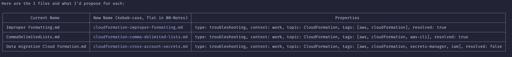
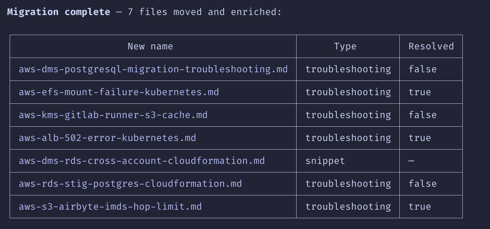

<div align="center">

# Obsidian CLI Skill for Claude Code


[](https://github.com/cwaits6/obsidian-cli-skill/releases)
[](LICENSE)
[](https://obsidian.md)
[](https://claude.ai/code)

</div>

Stop manually organizing your Obsidian vault. This skill teaches Claude to migrate, enrich, and restructure your notes — reading each one, assigning properties based on content, renaming to your conventions, and updating every link automatically. You review a proposal, approve it, and watch hundreds of notes get organized in minutes.

## Quick Start

```bash
# In Claude Code terminal:
/plugin marketplace add cwaits6/obsidian-cli-skill
/plugin install obsidian-cli@obsidian-cli-skill
```

Then just ask:

```
Migrate all my notes from Research/ to Notes/ with automatic property assignment
```

## What It Does

- **Migrate and enrich notes** — reads content, assigns type/context/topic properties, renames to your convention, moves to the right folder, updates all links
- **Create Obsidian Bases** — generates `.base` files that query your notes by properties for structured views
- **Generate Templater templates** — builds templates with dynamic syntax for automating note creation
- **Bulk operations** — rename, move, delete, or update properties across hundreds of files
- **Search and analyze** — find notes by content, trace link structure, surface orphans and broken links
- **Manage plugins and themes** — enable, disable, install via CLI

All 95+ Obsidian CLI commands are documented with syntax, parameters, and examples.

## How It Works

Every operation follows the same approval workflow:

1. **Analyze** — Claude reads your notes and config
2. **Propose** — you see exactly what will happen before anything changes
3. **Approve** — you say yes (or adjust)
4. **Execute** — commands run via Obsidian CLI

**Step 1: Claude proposes changes for review**



**Step 2: Migration complete with summary**



Batch operations split into manageable chunks. You control batch size and whether to approve per-batch or per-note in your config.

## Configuration

Copy the example config and customize for your vault:

```bash
cp ~/.claude/plugins/marketplaces/obsidian-cli-skill/plugins/obsidian-cli/config.yaml.example \
   ~/.claude/plugins/marketplaces/obsidian-cli-skill/plugins/obsidian-cli/config.yaml
```

The config defines your property schema (types, contexts, topics), naming conventions, and batch settings. See [`config.yaml.example`](plugins/obsidian-cli/config.yaml.example) for all options.

Your `config.yaml` is gitignored — plugin updates won't overwrite it.

### Updating

```bash
/plugin marketplace update
```

## Requirements

- Obsidian 1.12.1 or later with CLI enabled
- Claude Code with plugin support

## Contributing

Contributions welcome! See [CONTRIBUTING.md](CONTRIBUTING.md) for guidelines.

## Changelog

See [CHANGELOG.md](CHANGELOG.md) for version history.

## License

MIT License — see [LICENSE](LICENSE) for details.
